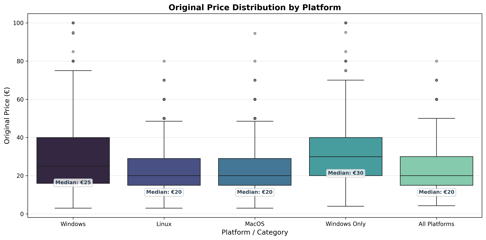
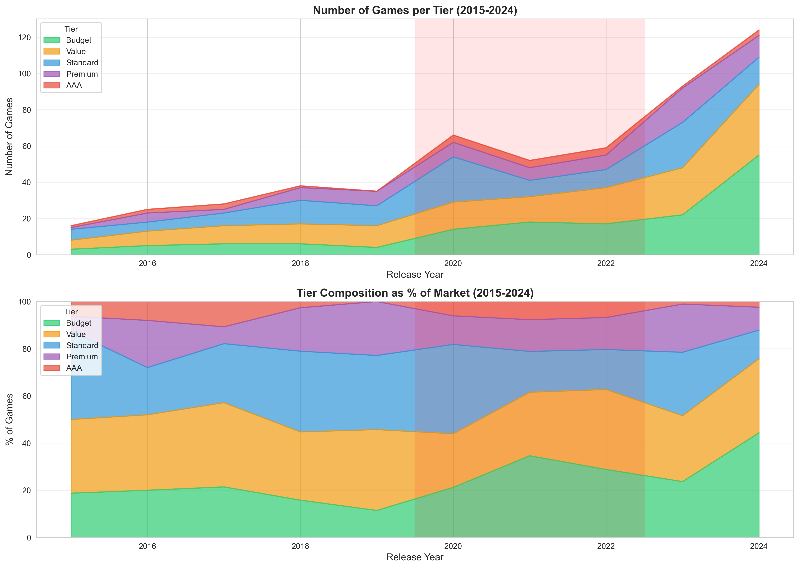
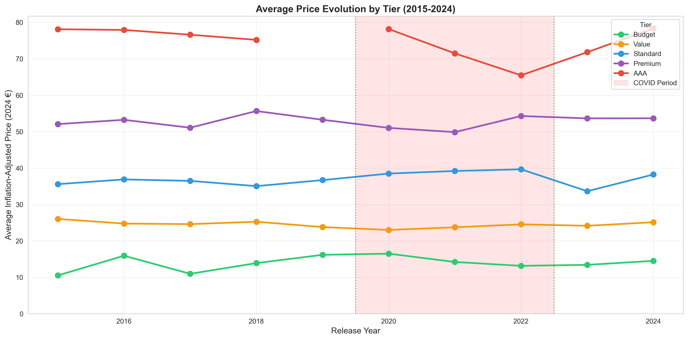
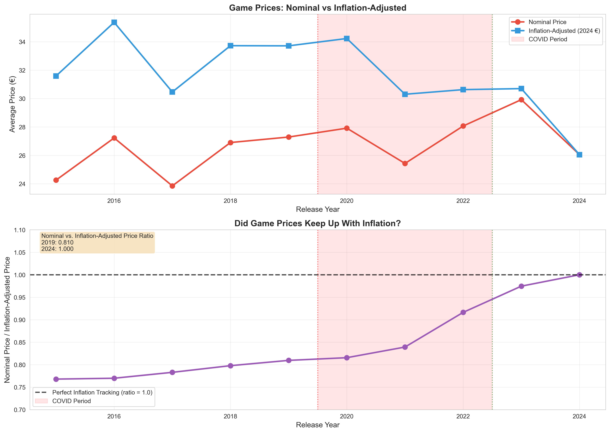

# Projects

## 2024–2025

### Video Game Price Analysis

A data science project analyzing Steam video game pricing patterns in the European market (2015-2024). Investigates whether game prices have kept pace with inflation and how COVID-19 affected pricing strategies. Uses HICP (Harmonised Index of Consumer Prices) to compare real vs nominal prices across years.

[View the interactive analysis notebooks →](https://jbenigeri.github.io/Video-Game-Price-Analysis/) | [GitHub](https://github.com/jbenigeri/Video-Game-Price-Analysis)

#### Part 1: Exploratory Data Analysis
[View Notebook →](https://jbenigeri.github.io/Video-Game-Price-Analysis/nb1-exploratory-data-analysis/)

Data cleaning, correlation analysis, platform availability patterns, and price distributions across Windows, Linux, and MacOS. Filters the dataset to 2015-2024 for meaningful trend analysis.

#### Part 2: Price & Inflation Analysis
[View Notebook →](https://jbenigeri.github.io/Video-Game-Price-Analysis/nb2-prices-analysis/)

Inflation adjustment using HICP, nominal vs real price comparisons, COVID-19 impact analysis (2020-2022), price tier composition over time, and psychological price point patterns.

---

### Hand Gesture Detection

Real-time hand gesture recognition for video call reactions using MediaPipe and OpenCV. Detects gestures like 👍 Thumbs Up, 👎 Thumbs Down, ✋ Raised Hand, and 👏 Clapping using hand landmarks + heuristics. Includes a Streamlit data collection dashboard for recording labeled gesture samples, plus ML model training (Random Forest, SVM) to expand detection to more gestures without sacrificing accuracy—since pure heuristics get confused by similar hand positions.

[GitHub](https://github.com/jbenigeri/Hand-Gestures-Detection)

---

## 2017

### Machine Learning for Handwritten Digit Recognition

**International Summer Science Institute (ISSI) — Weizmann Institute of Science**

Built classifiers for handwritten digit recognition (MNIST) using KNN, SVM, ANN, and CNN. Achieved 99%+ accuracy with the CNN model. Worked with Daniel Burghardt and Viney Kumar, mentored by Itay Safran and Dr. Ohad Shamir. This was my first exposure to machine learning and deep learning.

[View Project Report (PDF, p.106) →](https://www.weizmann.org.uk/assets/site/documents/Reports_ISSI2017.pdf)
