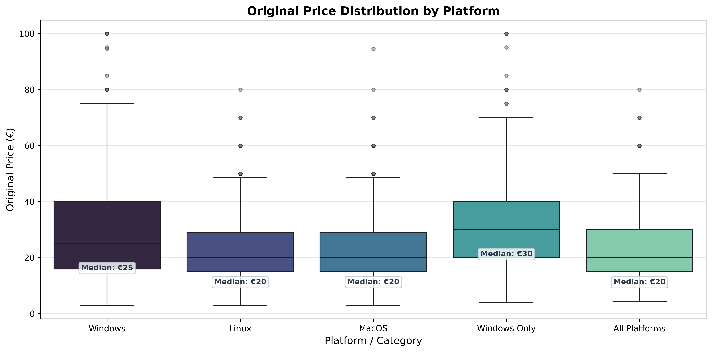
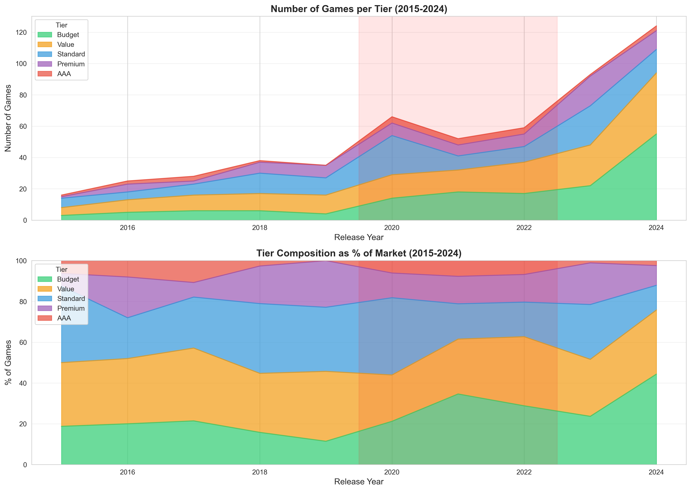
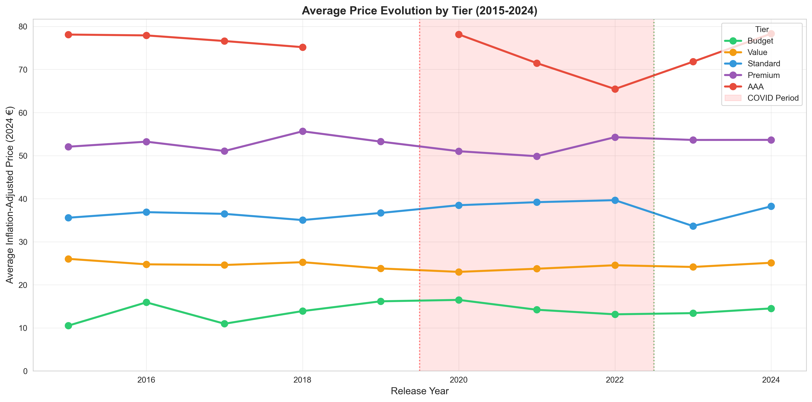
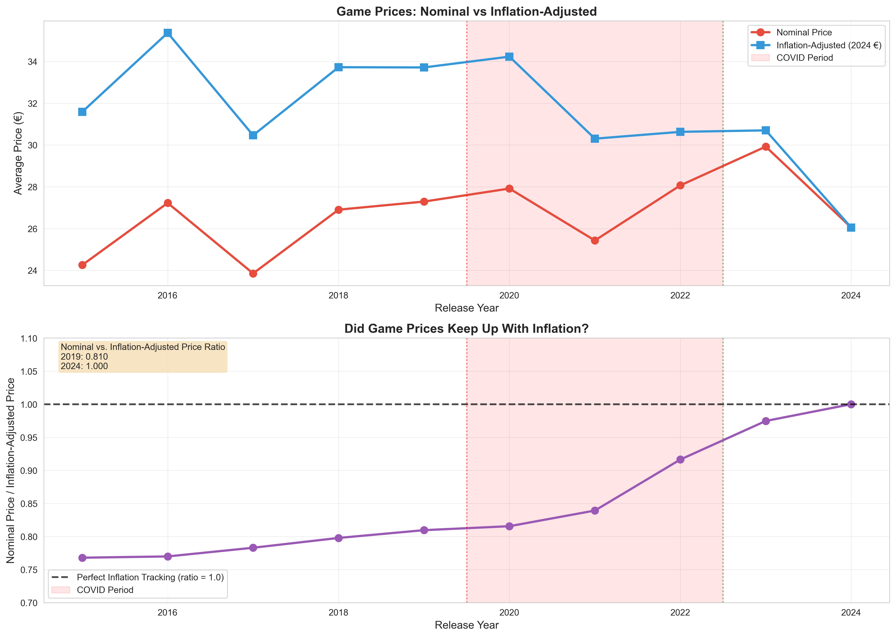

# Projects

## 2025–2026

### Video Game Price Analysis

A data science project analyzing whether Steam video game prices in the European market have kept pace with inflation over the past decade (2015–2024), and how COVID-19 affected pricing strategies. I deliberately chose a domain I knew well so I could ask the right questions—like whether psychological price points and game tier composition were shifting alongside broader trends—and spot when a finding needed deeper investigation.

[View the interactive analysis notebooks →](https://jbenigeri.github.io/Video-Game-Price-Analysis/) | [GitHub](https://github.com/jbenigeri/Video-Game-Price-Analysis)

#### Part 1: Exploratory Data Analysis
[View Notebook →](https://jbenigeri.github.io/Video-Game-Price-Analysis/nb1-exploratory-data-analysis/)

Cleaned and merged Steam sales data with Eurostat HICP indices, filtered to 2015–2024 for meaningful trend analysis. Covers correlation analysis, platform availability patterns, and price distributions across Windows, Linux, and MacOS.

#### Part 2: Price & Inflation Analysis
[View Notebook →](https://jbenigeri.github.io/Video-Game-Price-Analysis/nb2-prices-analysis/)

Adjusted prices using HICP to compare real versus nominal trends over time, and used statistical modeling to measure how pricing shifted across periods. Covers COVID-19 impact analysis (2020–2022), price tier composition over time, and psychological price point patterns.

---

### Hand Gesture Recognition

A demo of my own version of Zoom's hand gesture recognition feature—real-time detection of 9 common video call gestures (👍 👎 ✋ 👏 ✌️ 👌 👆 🤘 ✊) with emoji reactions displayed on screen.

I started with a rules-based system using [MediaPipe Hands](https://google.github.io/mediapipe/solutions/hands.html) landmark detection, which worked for distinct gestures like thumbs-up but confused similar hand positions (e.g. peace sign vs. the number two). So I built a data collection tool, recorded labeled video clips across varying hand positions, distances, and lighting conditions, and trained a Random Forest classifier on the landmark data—achieving 98.9% accuracy across all 9 gesture classes on my dataset. The Streamlit UI provides a live webcam feed, gesture toggle controls, and a statistics dashboard.

Built with the help of LLM coding assistants, but the decisions that mattered—like when to abandon rules for machine learning—were mine.

[GitHub](https://github.com/jbenigeri/Hand-Gestures-Detection)

---

## 2017

### Machine Learning for Handwritten Digit Recognition

**International Summer Science Institute (ISSI) — Weizmann Institute of Science**

Built classifiers for handwritten digit recognition (MNIST) using KNN, SVM, ANN, and CNN. Achieved 99%+ accuracy with the CNN model. Worked with Daniel Burghardt and Viney Kumar, mentored by Itay Safran and Dr. Ohad Shamir. This was my first exposure to machine learning and deep learning.

[View Project Report (PDF, p.106) →](https://www.weizmann.org.uk/assets/site/documents/Reports_ISSI2017.pdf)
